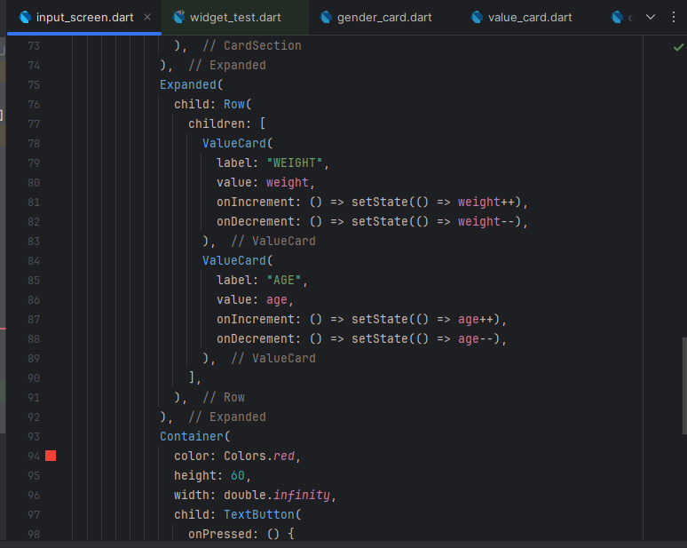

# ibm_calculator

A new Flutter project.

## App Intro

This app is a Body Mass Index (BMI) calculator. It helps users estimate their BMI by entering height and weight, then shows the BMI value with a basic health category (Underweight, Normal, or Overweight).

## Getting Started

This project is a starting point for a Flutter application.

This is a project to calculate the body mass index.

Screenshoots of code
this is the main file code 

This is the code of card file 

this is the code of input screen

This is the code of result screen

This is the code of value card

A few resources to get you started if this is your first Flutter project:

- [Lab: Write your first Flutter app](https://docs.flutter.dev/get-started/codelab)
- [Cookbook: Useful Flutter samples](https://docs.flutter.dev/cookbook)

For help getting started with Flutter development, view the
[online documentation](https://docs.flutter.dev/), which offers tutorials,
samples, guidance on mobile development, and a full API reference.
